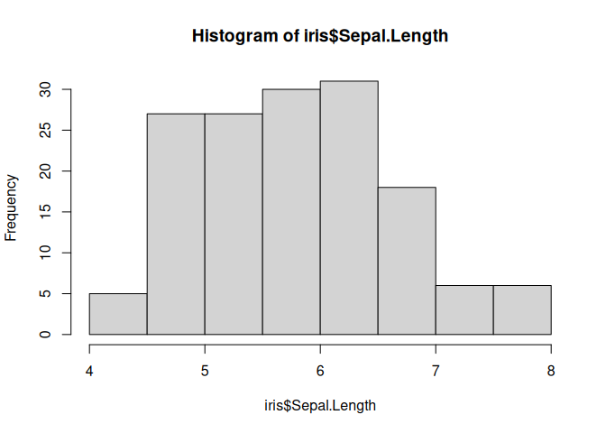
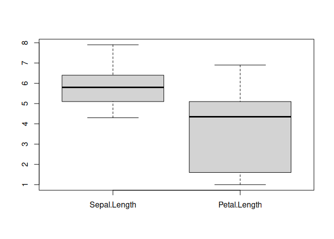

Basic R
================
Techo
2025-03-03

### Basic Calculation

``` r
# basic calculation 
1 + 1 
```

    ## [1] 2

``` r
2 - 3 
```

    ## [1] -1

``` r
2 * 5 
```

    ## [1] 10

``` r
2 / 2 
```

    ## [1] 1

``` r
# basic function in calculation
log(100)
```

    ## [1] 4.60517

``` r
sqrt(9)
```

    ## [1] 3

``` r
exp(5) 
```

    ## [1] 148.4132

### Create Variable

``` r
# use assign operator (<-) or =
x <- 100 
y <- 200 
one <- 1
Two <- 2
three <- 3
x + y
```

    ## [1] 300

``` r
one * Two
```

    ## [1] 2

``` r
one * Two + three
```

    ## [1] 5

### Data structure

``` r
# vector: a sequence of elements which share the same data type 
scores <- c(80, 99, 90, 72, 55) 
names <- c("David","Jan","Zuu","Tedy")
scores
```

    ## [1] 80 99 90 72 55

``` r
names
```

    ## [1] "David" "Jan"   "Zuu"   "Tedy"

``` r
# try this 
scores + 10 
```

    ## [1]  90 109 100  82  65

``` r
scores * 2 
```

    ## [1] 160 198 180 144 110

``` r
updated <- c(5, 2, 3, 5, 7) 
new_scores <- scores + updated 
```

``` r
new_scores[1] # 85 
```

    ## [1] 85

``` r
new_scores[1:3] # 85 101 93 
```

    ## [1]  85 101  93

``` r
new_scores[3:5] # 93 77 62 
```

    ## [1] 93 77 62

### Data type

``` r
# numeric vector 
x <- c(100, 200, 300) 
class(x) 
```

    ## [1] "numeric"

``` r
is.numeric(x)
```

    ## [1] TRUE

``` r
x
```

    ## [1] 100 200 300

``` r
# character vector
y <- c("Jason", "Momoa", "AquaMan") 
class(y) 
```

    ## [1] "character"

``` r
is.character(y)
```

    ## [1] TRUE

``` r
y
```

    ## [1] "Jason"   "Momoa"   "AquaMan"

``` r
# logical vector 
z <- c(TRUE, FALSE) 
class(z) 
```

    ## [1] "logical"

``` r
is.logical(z) 
```

    ## [1] TRUE

``` r
z
```

    ## [1]  TRUE FALSE

``` r
# create character vector 
animals <- c("Dog", "Cat", "Dog", "Dog", "Hippo") 
class(animals)
```

    ## [1] "character"

``` r
animals
```

    ## [1] "Dog"   "Cat"   "Dog"   "Dog"   "Hippo"

``` r
# convert character to factor 
animals <- as.factor(animals) 
class(animals)
```

    ## [1] "factor"

``` r
animals
```

    ## [1] Dog   Cat   Dog   Dog   Hippo
    ## Levels: Cat Dog Hippo

### Data frame

``` r
# create three vectors 
students <- c("Joe", "Jason", "Momoa", "Anna", "Mary") 
scores <- c(69, 89, 92, 56, 87) 
grades <- c("C+", "B+", "A", "C", "B+") 
# create a single dataframe 
df <- data.frame(students, scores, grades) 
class(df)
```

    ## [1] "data.frame"

``` r
df
```

    ##   students scores grades
    ## 1      Joe     69     C+
    ## 2    Jason     89     B+
    ## 3    Momoa     92      A
    ## 4     Anna     56      C
    ## 5     Mary     87     B+

### Simple function for Dataframe

``` r
# try this in RStudio
str(df) 
```

    ## 'data.frame':    5 obs. of  3 variables:
    ##  $ students: chr  "Joe" "Jason" "Momoa" "Anna" ...
    ##  $ scores  : num  69 89 92 56 87
    ##  $ grades  : chr  "C+" "B+" "A" "C" ...

``` r
head(df) 
```

    ##   students scores grades
    ## 1      Joe     69     C+
    ## 2    Jason     89     B+
    ## 3    Momoa     92      A
    ## 4     Anna     56      C
    ## 5     Mary     87     B+

``` r
tail(df) 
```

    ##   students scores grades
    ## 1      Joe     69     C+
    ## 2    Jason     89     B+
    ## 3    Momoa     92      A
    ## 4     Anna     56      C
    ## 5     Mary     87     B+

``` r
summary(df)
```

    ##    students             scores        grades         
    ##  Length:5           Min.   :56.0   Length:5          
    ##  Class :character   1st Qu.:69.0   Class :character  
    ##  Mode  :character   Median :87.0   Mode  :character  
    ##                     Mean   :78.6                     
    ##                     3rd Qu.:89.0                     
    ##                     Max.   :92.0

### Example Dataframe iris

``` r
head(iris)
```

    ##   Sepal.Length Sepal.Width Petal.Length Petal.Width Species
    ## 1          5.1         3.5          1.4         0.2  setosa
    ## 2          4.9         3.0          1.4         0.2  setosa
    ## 3          4.7         3.2          1.3         0.2  setosa
    ## 4          4.6         3.1          1.5         0.2  setosa
    ## 5          5.0         3.6          1.4         0.2  setosa
    ## 6          5.4         3.9          1.7         0.4  setosa

``` r
tail(iris)
```

    ##     Sepal.Length Sepal.Width Petal.Length Petal.Width   Species
    ## 145          6.7         3.3          5.7         2.5 virginica
    ## 146          6.7         3.0          5.2         2.3 virginica
    ## 147          6.3         2.5          5.0         1.9 virginica
    ## 148          6.5         3.0          5.2         2.0 virginica
    ## 149          6.2         3.4          5.4         2.3 virginica
    ## 150          5.9         3.0          5.1         1.8 virginica

``` r
str(iris)
```

    ## 'data.frame':    150 obs. of  5 variables:
    ##  $ Sepal.Length: num  5.1 4.9 4.7 4.6 5 5.4 4.6 5 4.4 4.9 ...
    ##  $ Sepal.Width : num  3.5 3 3.2 3.1 3.6 3.9 3.4 3.4 2.9 3.1 ...
    ##  $ Petal.Length: num  1.4 1.4 1.3 1.5 1.4 1.7 1.4 1.5 1.4 1.5 ...
    ##  $ Petal.Width : num  0.2 0.2 0.2 0.2 0.2 0.4 0.3 0.2 0.2 0.1 ...
    ##  $ Species     : Factor w/ 3 levels "setosa","versicolor",..: 1 1 1 1 1 1 1 1 1 1 ...

``` r
summary(iris)
```

    ##   Sepal.Length    Sepal.Width     Petal.Length    Petal.Width   
    ##  Min.   :4.300   Min.   :2.000   Min.   :1.000   Min.   :0.100  
    ##  1st Qu.:5.100   1st Qu.:2.800   1st Qu.:1.600   1st Qu.:0.300  
    ##  Median :5.800   Median :3.000   Median :4.350   Median :1.300  
    ##  Mean   :5.843   Mean   :3.057   Mean   :3.758   Mean   :1.199  
    ##  3rd Qu.:6.400   3rd Qu.:3.300   3rd Qu.:5.100   3rd Qu.:1.800  
    ##  Max.   :7.900   Max.   :4.400   Max.   :6.900   Max.   :2.500  
    ##        Species  
    ##  setosa    :50  
    ##  versicolor:50  
    ##  virginica :50  
    ##                 
    ##                 
    ## 

### Edit or View column or row names

``` r
colnames(iris)
```

    ## [1] "Sepal.Length" "Sepal.Width"  "Petal.Length" "Petal.Width"  "Species"

``` r
rownames(iris)
```

    ##   [1] "1"   "2"   "3"   "4"   "5"   "6"   "7"   "8"   "9"   "10"  "11"  "12" 
    ##  [13] "13"  "14"  "15"  "16"  "17"  "18"  "19"  "20"  "21"  "22"  "23"  "24" 
    ##  [25] "25"  "26"  "27"  "28"  "29"  "30"  "31"  "32"  "33"  "34"  "35"  "36" 
    ##  [37] "37"  "38"  "39"  "40"  "41"  "42"  "43"  "44"  "45"  "46"  "47"  "48" 
    ##  [49] "49"  "50"  "51"  "52"  "53"  "54"  "55"  "56"  "57"  "58"  "59"  "60" 
    ##  [61] "61"  "62"  "63"  "64"  "65"  "66"  "67"  "68"  "69"  "70"  "71"  "72" 
    ##  [73] "73"  "74"  "75"  "76"  "77"  "78"  "79"  "80"  "81"  "82"  "83"  "84" 
    ##  [85] "85"  "86"  "87"  "88"  "89"  "90"  "91"  "92"  "93"  "94"  "95"  "96" 
    ##  [97] "97"  "98"  "99"  "100" "101" "102" "103" "104" "105" "106" "107" "108"
    ## [109] "109" "110" "111" "112" "113" "114" "115" "116" "117" "118" "119" "120"
    ## [121] "121" "122" "123" "124" "125" "126" "127" "128" "129" "130" "131" "132"
    ## [133] "133" "134" "135" "136" "137" "138" "139" "140" "141" "142" "143" "144"
    ## [145] "145" "146" "147" "148" "149" "150"

### Subset dataframe

``` r
# subset rows 1-10, all columns 
iris[1:5, ]
```

    ##   Sepal.Length Sepal.Width Petal.Length Petal.Width Species
    ## 1          5.1         3.5          1.4         0.2  setosa
    ## 2          4.9         3.0          1.4         0.2  setosa
    ## 3          4.7         3.2          1.3         0.2  setosa
    ## 4          4.6         3.1          1.5         0.2  setosa
    ## 5          5.0         3.6          1.4         0.2  setosa

``` r
# subset rows 1-10, columns 1-5 
iris[1:5, 1:5] 
```

    ##   Sepal.Length Sepal.Width Petal.Length Petal.Width Species
    ## 1          5.1         3.5          1.4         0.2  setosa
    ## 2          4.9         3.0          1.4         0.2  setosa
    ## 3          4.7         3.2          1.3         0.2  setosa
    ## 4          4.6         3.1          1.5         0.2  setosa
    ## 5          5.0         3.6          1.4         0.2  setosa

``` r
# subset all rows, columns 1-5 
head(iris[ , 1:5]) 
```

    ##   Sepal.Length Sepal.Width Petal.Length Petal.Width Species
    ## 1          5.1         3.5          1.4         0.2  setosa
    ## 2          4.9         3.0          1.4         0.2  setosa
    ## 3          4.7         3.2          1.3         0.2  setosa
    ## 4          4.6         3.1          1.5         0.2  setosa
    ## 5          5.0         3.6          1.4         0.2  setosa
    ## 6          5.4         3.9          1.7         0.4  setosa

``` r
# subset by column names 
head(iris[ , "Sepal.Width"]) 
```

    ## [1] 3.5 3.0 3.2 3.1 3.6 3.9

``` r
head(iris[ , c("Sepal.Length", "Petal.Length", "Species")])
```

    ##   Sepal.Length Petal.Length Species
    ## 1          5.1          1.4  setosa
    ## 2          4.9          1.4  setosa
    ## 3          4.7          1.3  setosa
    ## 4          4.6          1.5  setosa
    ## 5          5.0          1.4  setosa
    ## 6          5.4          1.7  setosa

### Create New subset dataframe

``` r
subset_iris  <- iris[1:10, c("Sepal.Length", "Petal.Length", "Species")]
print(subset_iris )
```

    ##    Sepal.Length Petal.Length Species
    ## 1           5.1          1.4  setosa
    ## 2           4.9          1.4  setosa
    ## 3           4.7          1.3  setosa
    ## 4           4.6          1.5  setosa
    ## 5           5.0          1.4  setosa
    ## 6           5.4          1.7  setosa
    ## 7           4.6          1.4  setosa
    ## 8           5.0          1.5  setosa
    ## 9           4.4          1.4  setosa
    ## 10          4.9          1.5  setosa

### Data Wrangling

``` r
### install extra package ###
## Call package ##
library(dplyr)
```

    ## 
    ## Attaching package: 'dplyr'

    ## The following objects are masked from 'package:stats':
    ## 
    ##     filter, lag

    ## The following objects are masked from 'package:base':
    ## 
    ##     intersect, setdiff, setequal, union

## Select()

``` r
# select columns 1-5 
head(select(iris, 1:5)) 
```

    ##   Sepal.Length Sepal.Width Petal.Length Petal.Width Species
    ## 1          5.1         3.5          1.4         0.2  setosa
    ## 2          4.9         3.0          1.4         0.2  setosa
    ## 3          4.7         3.2          1.3         0.2  setosa
    ## 4          4.6         3.1          1.5         0.2  setosa
    ## 5          5.0         3.6          1.4         0.2  setosa
    ## 6          5.4         3.9          1.7         0.4  setosa

``` r
# select columns Sepal.Length, Petal.Length, Species
head(select(iris, Sepal.Length, Petal.Length, Species))
```

    ##   Sepal.Length Petal.Length Species
    ## 1          5.1          1.4  setosa
    ## 2          4.9          1.4  setosa
    ## 3          4.7          1.3  setosa
    ## 4          4.6          1.5  setosa
    ## 5          5.0          1.4  setosa
    ## 6          5.4          1.7  setosa

## filter()

``` r
# filter cars with Sepal.Length < 5
filter(iris, Sepal.Length < 5)
```

    ##    Sepal.Length Sepal.Width Petal.Length Petal.Width    Species
    ## 1           4.9         3.0          1.4         0.2     setosa
    ## 2           4.7         3.2          1.3         0.2     setosa
    ## 3           4.6         3.1          1.5         0.2     setosa
    ## 4           4.6         3.4          1.4         0.3     setosa
    ## 5           4.4         2.9          1.4         0.2     setosa
    ## 6           4.9         3.1          1.5         0.1     setosa
    ## 7           4.8         3.4          1.6         0.2     setosa
    ## 8           4.8         3.0          1.4         0.1     setosa
    ## 9           4.3         3.0          1.1         0.1     setosa
    ## 10          4.6         3.6          1.0         0.2     setosa
    ## 11          4.8         3.4          1.9         0.2     setosa
    ## 12          4.7         3.2          1.6         0.2     setosa
    ## 13          4.8         3.1          1.6         0.2     setosa
    ## 14          4.9         3.1          1.5         0.2     setosa
    ## 15          4.9         3.6          1.4         0.1     setosa
    ## 16          4.4         3.0          1.3         0.2     setosa
    ## 17          4.5         2.3          1.3         0.3     setosa
    ## 18          4.4         3.2          1.3         0.2     setosa
    ## 19          4.8         3.0          1.4         0.3     setosa
    ## 20          4.6         3.2          1.4         0.2     setosa
    ## 21          4.9         2.4          3.3         1.0 versicolor
    ## 22          4.9         2.5          4.5         1.7  virginica

``` r
# filter cars with Petal.Length == 1.4 
filter(iris, Petal.Length == 1.4) 
```

    ##    Sepal.Length Sepal.Width Petal.Length Petal.Width Species
    ## 1           5.1         3.5          1.4         0.2  setosa
    ## 2           4.9         3.0          1.4         0.2  setosa
    ## 3           5.0         3.6          1.4         0.2  setosa
    ## 4           4.6         3.4          1.4         0.3  setosa
    ## 5           4.4         2.9          1.4         0.2  setosa
    ## 6           4.8         3.0          1.4         0.1  setosa
    ## 7           5.1         3.5          1.4         0.3  setosa
    ## 8           5.2         3.4          1.4         0.2  setosa
    ## 9           5.5         4.2          1.4         0.2  setosa
    ## 10          4.9         3.6          1.4         0.1  setosa
    ## 11          4.8         3.0          1.4         0.3  setosa
    ## 12          4.6         3.2          1.4         0.2  setosa
    ## 13          5.0         3.3          1.4         0.2  setosa

### Equality Condition

# ==

# !=

# \>

# \>=

# \<

# \<=

``` r
# see if any numbers <= 300 
numbers <- c(100, 200, 300, 50) 
numbers <= 100
```

    ## [1]  TRUE FALSE FALSE  TRUE

``` r
# this will return FALSE because R is case-sensitive 
"hello" == "Hello" 
```

    ## [1] FALSE

### Arrange data

``` r
# sort column hp from low to high 
head(arrange(iris, Sepal.Length)) 
```

    ##   Sepal.Length Sepal.Width Petal.Length Petal.Width Species
    ## 1          4.3         3.0          1.1         0.1  setosa
    ## 2          4.4         2.9          1.4         0.2  setosa
    ## 3          4.4         3.0          1.3         0.2  setosa
    ## 4          4.4         3.2          1.3         0.2  setosa
    ## 5          4.5         2.3          1.3         0.3  setosa
    ## 6          4.6         3.1          1.5         0.2  setosa

``` r
# sort column hp from high to low \
head(arrange(iris, desc(Sepal.Length))) 
```

    ##   Sepal.Length Sepal.Width Petal.Length Petal.Width   Species
    ## 1          7.9         3.8          6.4         2.0 virginica
    ## 2          7.7         3.8          6.7         2.2 virginica
    ## 3          7.7         2.6          6.9         2.3 virginica
    ## 4          7.7         2.8          6.7         2.0 virginica
    ## 5          7.7         3.0          6.1         2.3 virginica
    ## 6          7.6         3.0          6.6         2.1 virginica

### Basic Plot

``` r
hist(iris$Sepal.Length)
```

<!-- -->

``` r
boxplot(iris[,c("Sepal.Length", "Petal.Length")])
```

<!-- -->

``` r
data_for_bar_plot<-c(A=27,B=0,C=50,D=20)
barplot(data_for_bar_plot)
```

<!-- -->
