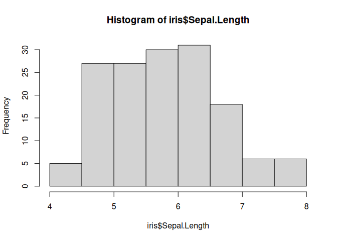
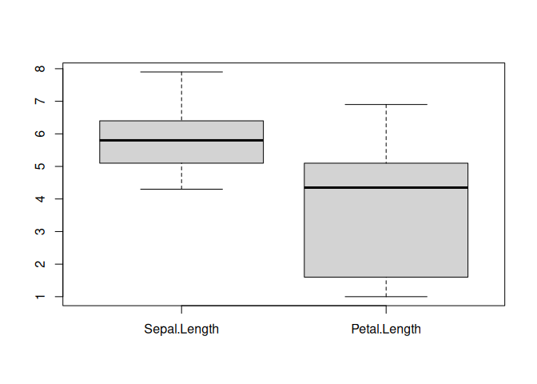
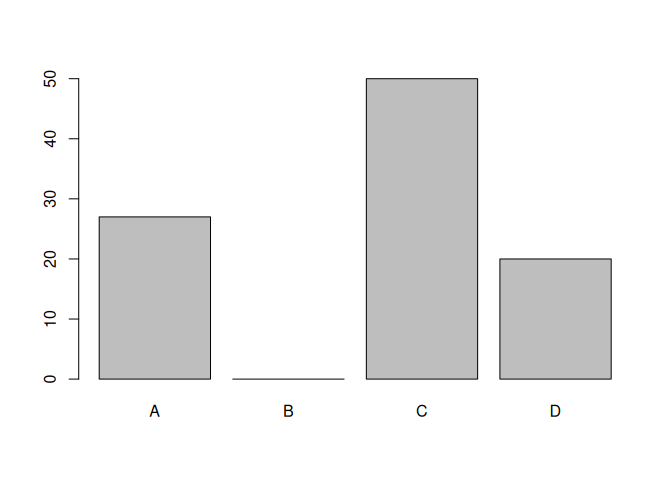

Basic R
================
Techo
2025-03-03

### Basic Calculation

``` r
# basic calculation 
1 + 1 
```

    ## [1] 2

``` r
2 - 3 
```

    ## [1] -1

``` r
2 * 5 
```

    ## [1] 10

``` r
2 / 2 
```

    ## [1] 1

``` r
# basic function in calculation
log(100)
```

    ## [1] 4.60517

``` r
sqrt(9)
```

    ## [1] 3

``` r
exp(5) 
```

    ## [1] 148.4132

### Create Variable

``` r
# use assign operator (<-) or =
x <- 100 
y <- 200 
one <- 1
Two <- 2
three <- 3
x + y
```

    ## [1] 300

``` r
one * Two
```

    ## [1] 2

``` r
one * Two + three
```

    ## [1] 5

### Data structure

``` r
# vector: a sequence of elements which share the same data type 
scores <- c(80, 99, 90, 72, 55) 
names <- c("David","Jan","Zuu","Tedy")
scores
```

    ## [1] 80 99 90 72 55

``` r
names
```

    ## [1] "David" "Jan"   "Zuu"   "Tedy"

``` r
# try this 
scores + 10 
```

    ## [1]  90 109 100  82  65

``` r
scores * 2 
```

    ## [1] 160 198 180 144 110

``` r
updated <- c(5, 2, 3, 5, 7) 
new_scores <- scores + updated 
```

``` r
new_scores[1] # 85 
```

    ## [1] 85

``` r
new_scores[1:3] # 85 101 93 
```

    ## [1]  85 101  93

``` r
new_scores[3:5] # 93 77 62 
```

    ## [1] 93 77 62

### Data type

``` r
# numeric vector 
x <- c(100, 200, 300) 
class(x) 
```

    ## [1] "numeric"

``` r
is.numeric(x)
```

    ## [1] TRUE

``` r
x
```

    ## [1] 100 200 300

``` r
# character vector
y <- c("Jason", "Momoa", "AquaMan") 
class(y) 
```

    ## [1] "character"

``` r
is.character(y)
```

    ## [1] TRUE

``` r
y
```

    ## [1] "Jason"   "Momoa"   "AquaMan"

``` r
# logical vector 
z <- c(TRUE, FALSE) 
class(z) 
```

    ## [1] "logical"

``` r
is.logical(z) 
```

    ## [1] TRUE

``` r
z
```

    ## [1]  TRUE FALSE

``` r
# create character vector 
animals <- c("Dog", "Cat", "Dog", "Dog", "Hippo") 
class(animals)
```

    ## [1] "character"

``` r
animals
```

    ## [1] "Dog"   "Cat"   "Dog"   "Dog"   "Hippo"

``` r
# convert character to factor 
animals <- as.factor(animals) 
class(animals)
```

    ## [1] "factor"

``` r
animals
```

    ## [1] Dog   Cat   Dog   Dog   Hippo
    ## Levels: Cat Dog Hippo

### Data frame

``` r
# create three vectors 
students <- c("Joe", "Jason", "Momoa", "Anna", "Mary") 
scores <- c(69, 89, 92, 56, 87) 
grades <- c("C+", "B+", "A", "C", "B+") 
# create a single dataframe 
df <- data.frame(students, scores, grades) 
class(df)
```

    ## [1] "data.frame"

``` r
df
```

    ##   students scores grades
    ## 1      Joe     69     C+
    ## 2    Jason     89     B+
    ## 3    Momoa     92      A
    ## 4     Anna     56      C
    ## 5     Mary     87     B+

### Simple function for Dataframe

``` r
# try this in RStudio
str(df) 
```

    ## 'data.frame':    5 obs. of  3 variables:
    ##  $ students: chr  "Joe" "Jason" "Momoa" "Anna" ...
    ##  $ scores  : num  69 89 92 56 87
    ##  $ grades  : chr  "C+" "B+" "A" "C" ...

``` r
head(df) 
```

    ##   students scores grades
    ## 1      Joe     69     C+
    ## 2    Jason     89     B+
    ## 3    Momoa     92      A
    ## 4     Anna     56      C
    ## 5     Mary     87     B+

``` r
tail(df) 
```

    ##   students scores grades
    ## 1      Joe     69     C+
    ## 2    Jason     89     B+
    ## 3    Momoa     92      A
    ## 4     Anna     56      C
    ## 5     Mary     87     B+

``` r
summary(df)
```

    ##    students             scores        grades         
    ##  Length:5           Min.   :56.0   Length:5          
    ##  Class :character   1st Qu.:69.0   Class :character  
    ##  Mode  :character   Median :87.0   Mode  :character  
    ##                     Mean   :78.6                     
    ##                     3rd Qu.:89.0                     
    ##                     Max.   :92.0

### Example Dataframe iris

``` r
iris
```

    ##     Sepal.Length Sepal.Width Petal.Length Petal.Width    Species
    ## 1            5.1         3.5          1.4         0.2     setosa
    ## 2            4.9         3.0          1.4         0.2     setosa
    ## 3            4.7         3.2          1.3         0.2     setosa
    ## 4            4.6         3.1          1.5         0.2     setosa
    ## 5            5.0         3.6          1.4         0.2     setosa
    ## 6            5.4         3.9          1.7         0.4     setosa
    ## 7            4.6         3.4          1.4         0.3     setosa
    ## 8            5.0         3.4          1.5         0.2     setosa
    ## 9            4.4         2.9          1.4         0.2     setosa
    ## 10           4.9         3.1          1.5         0.1     setosa
    ## 11           5.4         3.7          1.5         0.2     setosa
    ## 12           4.8         3.4          1.6         0.2     setosa
    ## 13           4.8         3.0          1.4         0.1     setosa
    ## 14           4.3         3.0          1.1         0.1     setosa
    ## 15           5.8         4.0          1.2         0.2     setosa
    ## 16           5.7         4.4          1.5         0.4     setosa
    ## 17           5.4         3.9          1.3         0.4     setosa
    ## 18           5.1         3.5          1.4         0.3     setosa
    ## 19           5.7         3.8          1.7         0.3     setosa
    ## 20           5.1         3.8          1.5         0.3     setosa
    ## 21           5.4         3.4          1.7         0.2     setosa
    ## 22           5.1         3.7          1.5         0.4     setosa
    ## 23           4.6         3.6          1.0         0.2     setosa
    ## 24           5.1         3.3          1.7         0.5     setosa
    ## 25           4.8         3.4          1.9         0.2     setosa
    ## 26           5.0         3.0          1.6         0.2     setosa
    ## 27           5.0         3.4          1.6         0.4     setosa
    ## 28           5.2         3.5          1.5         0.2     setosa
    ## 29           5.2         3.4          1.4         0.2     setosa
    ## 30           4.7         3.2          1.6         0.2     setosa
    ## 31           4.8         3.1          1.6         0.2     setosa
    ## 32           5.4         3.4          1.5         0.4     setosa
    ## 33           5.2         4.1          1.5         0.1     setosa
    ## 34           5.5         4.2          1.4         0.2     setosa
    ## 35           4.9         3.1          1.5         0.2     setosa
    ## 36           5.0         3.2          1.2         0.2     setosa
    ## 37           5.5         3.5          1.3         0.2     setosa
    ## 38           4.9         3.6          1.4         0.1     setosa
    ## 39           4.4         3.0          1.3         0.2     setosa
    ## 40           5.1         3.4          1.5         0.2     setosa
    ## 41           5.0         3.5          1.3         0.3     setosa
    ## 42           4.5         2.3          1.3         0.3     setosa
    ## 43           4.4         3.2          1.3         0.2     setosa
    ## 44           5.0         3.5          1.6         0.6     setosa
    ## 45           5.1         3.8          1.9         0.4     setosa
    ## 46           4.8         3.0          1.4         0.3     setosa
    ## 47           5.1         3.8          1.6         0.2     setosa
    ## 48           4.6         3.2          1.4         0.2     setosa
    ## 49           5.3         3.7          1.5         0.2     setosa
    ## 50           5.0         3.3          1.4         0.2     setosa
    ## 51           7.0         3.2          4.7         1.4 versicolor
    ## 52           6.4         3.2          4.5         1.5 versicolor
    ## 53           6.9         3.1          4.9         1.5 versicolor
    ## 54           5.5         2.3          4.0         1.3 versicolor
    ## 55           6.5         2.8          4.6         1.5 versicolor
    ## 56           5.7         2.8          4.5         1.3 versicolor
    ## 57           6.3         3.3          4.7         1.6 versicolor
    ## 58           4.9         2.4          3.3         1.0 versicolor
    ## 59           6.6         2.9          4.6         1.3 versicolor
    ## 60           5.2         2.7          3.9         1.4 versicolor
    ## 61           5.0         2.0          3.5         1.0 versicolor
    ## 62           5.9         3.0          4.2         1.5 versicolor
    ## 63           6.0         2.2          4.0         1.0 versicolor
    ## 64           6.1         2.9          4.7         1.4 versicolor
    ## 65           5.6         2.9          3.6         1.3 versicolor
    ## 66           6.7         3.1          4.4         1.4 versicolor
    ## 67           5.6         3.0          4.5         1.5 versicolor
    ## 68           5.8         2.7          4.1         1.0 versicolor
    ## 69           6.2         2.2          4.5         1.5 versicolor
    ## 70           5.6         2.5          3.9         1.1 versicolor
    ## 71           5.9         3.2          4.8         1.8 versicolor
    ## 72           6.1         2.8          4.0         1.3 versicolor
    ## 73           6.3         2.5          4.9         1.5 versicolor
    ## 74           6.1         2.8          4.7         1.2 versicolor
    ## 75           6.4         2.9          4.3         1.3 versicolor
    ## 76           6.6         3.0          4.4         1.4 versicolor
    ## 77           6.8         2.8          4.8         1.4 versicolor
    ## 78           6.7         3.0          5.0         1.7 versicolor
    ## 79           6.0         2.9          4.5         1.5 versicolor
    ## 80           5.7         2.6          3.5         1.0 versicolor
    ## 81           5.5         2.4          3.8         1.1 versicolor
    ## 82           5.5         2.4          3.7         1.0 versicolor
    ## 83           5.8         2.7          3.9         1.2 versicolor
    ## 84           6.0         2.7          5.1         1.6 versicolor
    ## 85           5.4         3.0          4.5         1.5 versicolor
    ## 86           6.0         3.4          4.5         1.6 versicolor
    ## 87           6.7         3.1          4.7         1.5 versicolor
    ## 88           6.3         2.3          4.4         1.3 versicolor
    ## 89           5.6         3.0          4.1         1.3 versicolor
    ## 90           5.5         2.5          4.0         1.3 versicolor
    ## 91           5.5         2.6          4.4         1.2 versicolor
    ## 92           6.1         3.0          4.6         1.4 versicolor
    ## 93           5.8         2.6          4.0         1.2 versicolor
    ## 94           5.0         2.3          3.3         1.0 versicolor
    ## 95           5.6         2.7          4.2         1.3 versicolor
    ## 96           5.7         3.0          4.2         1.2 versicolor
    ## 97           5.7         2.9          4.2         1.3 versicolor
    ## 98           6.2         2.9          4.3         1.3 versicolor
    ## 99           5.1         2.5          3.0         1.1 versicolor
    ## 100          5.7         2.8          4.1         1.3 versicolor
    ## 101          6.3         3.3          6.0         2.5  virginica
    ## 102          5.8         2.7          5.1         1.9  virginica
    ## 103          7.1         3.0          5.9         2.1  virginica
    ## 104          6.3         2.9          5.6         1.8  virginica
    ## 105          6.5         3.0          5.8         2.2  virginica
    ## 106          7.6         3.0          6.6         2.1  virginica
    ## 107          4.9         2.5          4.5         1.7  virginica
    ## 108          7.3         2.9          6.3         1.8  virginica
    ## 109          6.7         2.5          5.8         1.8  virginica
    ## 110          7.2         3.6          6.1         2.5  virginica
    ## 111          6.5         3.2          5.1         2.0  virginica
    ## 112          6.4         2.7          5.3         1.9  virginica
    ## 113          6.8         3.0          5.5         2.1  virginica
    ## 114          5.7         2.5          5.0         2.0  virginica
    ## 115          5.8         2.8          5.1         2.4  virginica
    ## 116          6.4         3.2          5.3         2.3  virginica
    ## 117          6.5         3.0          5.5         1.8  virginica
    ## 118          7.7         3.8          6.7         2.2  virginica
    ## 119          7.7         2.6          6.9         2.3  virginica
    ## 120          6.0         2.2          5.0         1.5  virginica
    ## 121          6.9         3.2          5.7         2.3  virginica
    ## 122          5.6         2.8          4.9         2.0  virginica
    ## 123          7.7         2.8          6.7         2.0  virginica
    ## 124          6.3         2.7          4.9         1.8  virginica
    ## 125          6.7         3.3          5.7         2.1  virginica
    ## 126          7.2         3.2          6.0         1.8  virginica
    ## 127          6.2         2.8          4.8         1.8  virginica
    ## 128          6.1         3.0          4.9         1.8  virginica
    ## 129          6.4         2.8          5.6         2.1  virginica
    ## 130          7.2         3.0          5.8         1.6  virginica
    ## 131          7.4         2.8          6.1         1.9  virginica
    ## 132          7.9         3.8          6.4         2.0  virginica
    ## 133          6.4         2.8          5.6         2.2  virginica
    ## 134          6.3         2.8          5.1         1.5  virginica
    ## 135          6.1         2.6          5.6         1.4  virginica
    ## 136          7.7         3.0          6.1         2.3  virginica
    ## 137          6.3         3.4          5.6         2.4  virginica
    ## 138          6.4         3.1          5.5         1.8  virginica
    ## 139          6.0         3.0          4.8         1.8  virginica
    ## 140          6.9         3.1          5.4         2.1  virginica
    ## 141          6.7         3.1          5.6         2.4  virginica
    ## 142          6.9         3.1          5.1         2.3  virginica
    ## 143          5.8         2.7          5.1         1.9  virginica
    ## 144          6.8         3.2          5.9         2.3  virginica
    ## 145          6.7         3.3          5.7         2.5  virginica
    ## 146          6.7         3.0          5.2         2.3  virginica
    ## 147          6.3         2.5          5.0         1.9  virginica
    ## 148          6.5         3.0          5.2         2.0  virginica
    ## 149          6.2         3.4          5.4         2.3  virginica
    ## 150          5.9         3.0          5.1         1.8  virginica

``` r
str(iris)
```

    ## 'data.frame':    150 obs. of  5 variables:
    ##  $ Sepal.Length: num  5.1 4.9 4.7 4.6 5 5.4 4.6 5 4.4 4.9 ...
    ##  $ Sepal.Width : num  3.5 3 3.2 3.1 3.6 3.9 3.4 3.4 2.9 3.1 ...
    ##  $ Petal.Length: num  1.4 1.4 1.3 1.5 1.4 1.7 1.4 1.5 1.4 1.5 ...
    ##  $ Petal.Width : num  0.2 0.2 0.2 0.2 0.2 0.4 0.3 0.2 0.2 0.1 ...
    ##  $ Species     : Factor w/ 3 levels "setosa","versicolor",..: 1 1 1 1 1 1 1 1 1 1 ...

``` r
head(iris)
```

    ##   Sepal.Length Sepal.Width Petal.Length Petal.Width Species
    ## 1          5.1         3.5          1.4         0.2  setosa
    ## 2          4.9         3.0          1.4         0.2  setosa
    ## 3          4.7         3.2          1.3         0.2  setosa
    ## 4          4.6         3.1          1.5         0.2  setosa
    ## 5          5.0         3.6          1.4         0.2  setosa
    ## 6          5.4         3.9          1.7         0.4  setosa

``` r
tail(iris)
```

    ##     Sepal.Length Sepal.Width Petal.Length Petal.Width   Species
    ## 145          6.7         3.3          5.7         2.5 virginica
    ## 146          6.7         3.0          5.2         2.3 virginica
    ## 147          6.3         2.5          5.0         1.9 virginica
    ## 148          6.5         3.0          5.2         2.0 virginica
    ## 149          6.2         3.4          5.4         2.3 virginica
    ## 150          5.9         3.0          5.1         1.8 virginica

``` r
summary(iris)
```

    ##   Sepal.Length    Sepal.Width     Petal.Length    Petal.Width   
    ##  Min.   :4.300   Min.   :2.000   Min.   :1.000   Min.   :0.100  
    ##  1st Qu.:5.100   1st Qu.:2.800   1st Qu.:1.600   1st Qu.:0.300  
    ##  Median :5.800   Median :3.000   Median :4.350   Median :1.300  
    ##  Mean   :5.843   Mean   :3.057   Mean   :3.758   Mean   :1.199  
    ##  3rd Qu.:6.400   3rd Qu.:3.300   3rd Qu.:5.100   3rd Qu.:1.800  
    ##  Max.   :7.900   Max.   :4.400   Max.   :6.900   Max.   :2.500  
    ##        Species  
    ##  setosa    :50  
    ##  versicolor:50  
    ##  virginica :50  
    ##                 
    ##                 
    ## 

### Edit or View column or row names

``` r
colnames(iris)
```

    ## [1] "Sepal.Length" "Sepal.Width"  "Petal.Length" "Petal.Width"  "Species"

``` r
rownames(iris)
```

    ##   [1] "1"   "2"   "3"   "4"   "5"   "6"   "7"   "8"   "9"   "10"  "11"  "12" 
    ##  [13] "13"  "14"  "15"  "16"  "17"  "18"  "19"  "20"  "21"  "22"  "23"  "24" 
    ##  [25] "25"  "26"  "27"  "28"  "29"  "30"  "31"  "32"  "33"  "34"  "35"  "36" 
    ##  [37] "37"  "38"  "39"  "40"  "41"  "42"  "43"  "44"  "45"  "46"  "47"  "48" 
    ##  [49] "49"  "50"  "51"  "52"  "53"  "54"  "55"  "56"  "57"  "58"  "59"  "60" 
    ##  [61] "61"  "62"  "63"  "64"  "65"  "66"  "67"  "68"  "69"  "70"  "71"  "72" 
    ##  [73] "73"  "74"  "75"  "76"  "77"  "78"  "79"  "80"  "81"  "82"  "83"  "84" 
    ##  [85] "85"  "86"  "87"  "88"  "89"  "90"  "91"  "92"  "93"  "94"  "95"  "96" 
    ##  [97] "97"  "98"  "99"  "100" "101" "102" "103" "104" "105" "106" "107" "108"
    ## [109] "109" "110" "111" "112" "113" "114" "115" "116" "117" "118" "119" "120"
    ## [121] "121" "122" "123" "124" "125" "126" "127" "128" "129" "130" "131" "132"
    ## [133] "133" "134" "135" "136" "137" "138" "139" "140" "141" "142" "143" "144"
    ## [145] "145" "146" "147" "148" "149" "150"

### Subset dataframe

``` r
# subset rows 1-10, all columns 
iris[1:10, ]
```

    ##    Sepal.Length Sepal.Width Petal.Length Petal.Width Species
    ## 1           5.1         3.5          1.4         0.2  setosa
    ## 2           4.9         3.0          1.4         0.2  setosa
    ## 3           4.7         3.2          1.3         0.2  setosa
    ## 4           4.6         3.1          1.5         0.2  setosa
    ## 5           5.0         3.6          1.4         0.2  setosa
    ## 6           5.4         3.9          1.7         0.4  setosa
    ## 7           4.6         3.4          1.4         0.3  setosa
    ## 8           5.0         3.4          1.5         0.2  setosa
    ## 9           4.4         2.9          1.4         0.2  setosa
    ## 10          4.9         3.1          1.5         0.1  setosa

``` r
# subset rows 1-10, columns 1-5 
iris[1:10, 1:5] 
```

    ##    Sepal.Length Sepal.Width Petal.Length Petal.Width Species
    ## 1           5.1         3.5          1.4         0.2  setosa
    ## 2           4.9         3.0          1.4         0.2  setosa
    ## 3           4.7         3.2          1.3         0.2  setosa
    ## 4           4.6         3.1          1.5         0.2  setosa
    ## 5           5.0         3.6          1.4         0.2  setosa
    ## 6           5.4         3.9          1.7         0.4  setosa
    ## 7           4.6         3.4          1.4         0.3  setosa
    ## 8           5.0         3.4          1.5         0.2  setosa
    ## 9           4.4         2.9          1.4         0.2  setosa
    ## 10          4.9         3.1          1.5         0.1  setosa

``` r
# subset all rows, columns 1-5 
iris[ , 1:5] 
```

    ##     Sepal.Length Sepal.Width Petal.Length Petal.Width    Species
    ## 1            5.1         3.5          1.4         0.2     setosa
    ## 2            4.9         3.0          1.4         0.2     setosa
    ## 3            4.7         3.2          1.3         0.2     setosa
    ## 4            4.6         3.1          1.5         0.2     setosa
    ## 5            5.0         3.6          1.4         0.2     setosa
    ## 6            5.4         3.9          1.7         0.4     setosa
    ## 7            4.6         3.4          1.4         0.3     setosa
    ## 8            5.0         3.4          1.5         0.2     setosa
    ## 9            4.4         2.9          1.4         0.2     setosa
    ## 10           4.9         3.1          1.5         0.1     setosa
    ## 11           5.4         3.7          1.5         0.2     setosa
    ## 12           4.8         3.4          1.6         0.2     setosa
    ## 13           4.8         3.0          1.4         0.1     setosa
    ## 14           4.3         3.0          1.1         0.1     setosa
    ## 15           5.8         4.0          1.2         0.2     setosa
    ## 16           5.7         4.4          1.5         0.4     setosa
    ## 17           5.4         3.9          1.3         0.4     setosa
    ## 18           5.1         3.5          1.4         0.3     setosa
    ## 19           5.7         3.8          1.7         0.3     setosa
    ## 20           5.1         3.8          1.5         0.3     setosa
    ## 21           5.4         3.4          1.7         0.2     setosa
    ## 22           5.1         3.7          1.5         0.4     setosa
    ## 23           4.6         3.6          1.0         0.2     setosa
    ## 24           5.1         3.3          1.7         0.5     setosa
    ## 25           4.8         3.4          1.9         0.2     setosa
    ## 26           5.0         3.0          1.6         0.2     setosa
    ## 27           5.0         3.4          1.6         0.4     setosa
    ## 28           5.2         3.5          1.5         0.2     setosa
    ## 29           5.2         3.4          1.4         0.2     setosa
    ## 30           4.7         3.2          1.6         0.2     setosa
    ## 31           4.8         3.1          1.6         0.2     setosa
    ## 32           5.4         3.4          1.5         0.4     setosa
    ## 33           5.2         4.1          1.5         0.1     setosa
    ## 34           5.5         4.2          1.4         0.2     setosa
    ## 35           4.9         3.1          1.5         0.2     setosa
    ## 36           5.0         3.2          1.2         0.2     setosa
    ## 37           5.5         3.5          1.3         0.2     setosa
    ## 38           4.9         3.6          1.4         0.1     setosa
    ## 39           4.4         3.0          1.3         0.2     setosa
    ## 40           5.1         3.4          1.5         0.2     setosa
    ## 41           5.0         3.5          1.3         0.3     setosa
    ## 42           4.5         2.3          1.3         0.3     setosa
    ## 43           4.4         3.2          1.3         0.2     setosa
    ## 44           5.0         3.5          1.6         0.6     setosa
    ## 45           5.1         3.8          1.9         0.4     setosa
    ## 46           4.8         3.0          1.4         0.3     setosa
    ## 47           5.1         3.8          1.6         0.2     setosa
    ## 48           4.6         3.2          1.4         0.2     setosa
    ## 49           5.3         3.7          1.5         0.2     setosa
    ## 50           5.0         3.3          1.4         0.2     setosa
    ## 51           7.0         3.2          4.7         1.4 versicolor
    ## 52           6.4         3.2          4.5         1.5 versicolor
    ## 53           6.9         3.1          4.9         1.5 versicolor
    ## 54           5.5         2.3          4.0         1.3 versicolor
    ## 55           6.5         2.8          4.6         1.5 versicolor
    ## 56           5.7         2.8          4.5         1.3 versicolor
    ## 57           6.3         3.3          4.7         1.6 versicolor
    ## 58           4.9         2.4          3.3         1.0 versicolor
    ## 59           6.6         2.9          4.6         1.3 versicolor
    ## 60           5.2         2.7          3.9         1.4 versicolor
    ## 61           5.0         2.0          3.5         1.0 versicolor
    ## 62           5.9         3.0          4.2         1.5 versicolor
    ## 63           6.0         2.2          4.0         1.0 versicolor
    ## 64           6.1         2.9          4.7         1.4 versicolor
    ## 65           5.6         2.9          3.6         1.3 versicolor
    ## 66           6.7         3.1          4.4         1.4 versicolor
    ## 67           5.6         3.0          4.5         1.5 versicolor
    ## 68           5.8         2.7          4.1         1.0 versicolor
    ## 69           6.2         2.2          4.5         1.5 versicolor
    ## 70           5.6         2.5          3.9         1.1 versicolor
    ## 71           5.9         3.2          4.8         1.8 versicolor
    ## 72           6.1         2.8          4.0         1.3 versicolor
    ## 73           6.3         2.5          4.9         1.5 versicolor
    ## 74           6.1         2.8          4.7         1.2 versicolor
    ## 75           6.4         2.9          4.3         1.3 versicolor
    ## 76           6.6         3.0          4.4         1.4 versicolor
    ## 77           6.8         2.8          4.8         1.4 versicolor
    ## 78           6.7         3.0          5.0         1.7 versicolor
    ## 79           6.0         2.9          4.5         1.5 versicolor
    ## 80           5.7         2.6          3.5         1.0 versicolor
    ## 81           5.5         2.4          3.8         1.1 versicolor
    ## 82           5.5         2.4          3.7         1.0 versicolor
    ## 83           5.8         2.7          3.9         1.2 versicolor
    ## 84           6.0         2.7          5.1         1.6 versicolor
    ## 85           5.4         3.0          4.5         1.5 versicolor
    ## 86           6.0         3.4          4.5         1.6 versicolor
    ## 87           6.7         3.1          4.7         1.5 versicolor
    ## 88           6.3         2.3          4.4         1.3 versicolor
    ## 89           5.6         3.0          4.1         1.3 versicolor
    ## 90           5.5         2.5          4.0         1.3 versicolor
    ## 91           5.5         2.6          4.4         1.2 versicolor
    ## 92           6.1         3.0          4.6         1.4 versicolor
    ## 93           5.8         2.6          4.0         1.2 versicolor
    ## 94           5.0         2.3          3.3         1.0 versicolor
    ## 95           5.6         2.7          4.2         1.3 versicolor
    ## 96           5.7         3.0          4.2         1.2 versicolor
    ## 97           5.7         2.9          4.2         1.3 versicolor
    ## 98           6.2         2.9          4.3         1.3 versicolor
    ## 99           5.1         2.5          3.0         1.1 versicolor
    ## 100          5.7         2.8          4.1         1.3 versicolor
    ## 101          6.3         3.3          6.0         2.5  virginica
    ## 102          5.8         2.7          5.1         1.9  virginica
    ## 103          7.1         3.0          5.9         2.1  virginica
    ## 104          6.3         2.9          5.6         1.8  virginica
    ## 105          6.5         3.0          5.8         2.2  virginica
    ## 106          7.6         3.0          6.6         2.1  virginica
    ## 107          4.9         2.5          4.5         1.7  virginica
    ## 108          7.3         2.9          6.3         1.8  virginica
    ## 109          6.7         2.5          5.8         1.8  virginica
    ## 110          7.2         3.6          6.1         2.5  virginica
    ## 111          6.5         3.2          5.1         2.0  virginica
    ## 112          6.4         2.7          5.3         1.9  virginica
    ## 113          6.8         3.0          5.5         2.1  virginica
    ## 114          5.7         2.5          5.0         2.0  virginica
    ## 115          5.8         2.8          5.1         2.4  virginica
    ## 116          6.4         3.2          5.3         2.3  virginica
    ## 117          6.5         3.0          5.5         1.8  virginica
    ## 118          7.7         3.8          6.7         2.2  virginica
    ## 119          7.7         2.6          6.9         2.3  virginica
    ## 120          6.0         2.2          5.0         1.5  virginica
    ## 121          6.9         3.2          5.7         2.3  virginica
    ## 122          5.6         2.8          4.9         2.0  virginica
    ## 123          7.7         2.8          6.7         2.0  virginica
    ## 124          6.3         2.7          4.9         1.8  virginica
    ## 125          6.7         3.3          5.7         2.1  virginica
    ## 126          7.2         3.2          6.0         1.8  virginica
    ## 127          6.2         2.8          4.8         1.8  virginica
    ## 128          6.1         3.0          4.9         1.8  virginica
    ## 129          6.4         2.8          5.6         2.1  virginica
    ## 130          7.2         3.0          5.8         1.6  virginica
    ## 131          7.4         2.8          6.1         1.9  virginica
    ## 132          7.9         3.8          6.4         2.0  virginica
    ## 133          6.4         2.8          5.6         2.2  virginica
    ## 134          6.3         2.8          5.1         1.5  virginica
    ## 135          6.1         2.6          5.6         1.4  virginica
    ## 136          7.7         3.0          6.1         2.3  virginica
    ## 137          6.3         3.4          5.6         2.4  virginica
    ## 138          6.4         3.1          5.5         1.8  virginica
    ## 139          6.0         3.0          4.8         1.8  virginica
    ## 140          6.9         3.1          5.4         2.1  virginica
    ## 141          6.7         3.1          5.6         2.4  virginica
    ## 142          6.9         3.1          5.1         2.3  virginica
    ## 143          5.8         2.7          5.1         1.9  virginica
    ## 144          6.8         3.2          5.9         2.3  virginica
    ## 145          6.7         3.3          5.7         2.5  virginica
    ## 146          6.7         3.0          5.2         2.3  virginica
    ## 147          6.3         2.5          5.0         1.9  virginica
    ## 148          6.5         3.0          5.2         2.0  virginica
    ## 149          6.2         3.4          5.4         2.3  virginica
    ## 150          5.9         3.0          5.1         1.8  virginica

``` r
# subset by column names 
iris[ , "Sepal.Width"] 
```

    ##   [1] 3.5 3.0 3.2 3.1 3.6 3.9 3.4 3.4 2.9 3.1 3.7 3.4 3.0 3.0 4.0 4.4 3.9 3.5
    ##  [19] 3.8 3.8 3.4 3.7 3.6 3.3 3.4 3.0 3.4 3.5 3.4 3.2 3.1 3.4 4.1 4.2 3.1 3.2
    ##  [37] 3.5 3.6 3.0 3.4 3.5 2.3 3.2 3.5 3.8 3.0 3.8 3.2 3.7 3.3 3.2 3.2 3.1 2.3
    ##  [55] 2.8 2.8 3.3 2.4 2.9 2.7 2.0 3.0 2.2 2.9 2.9 3.1 3.0 2.7 2.2 2.5 3.2 2.8
    ##  [73] 2.5 2.8 2.9 3.0 2.8 3.0 2.9 2.6 2.4 2.4 2.7 2.7 3.0 3.4 3.1 2.3 3.0 2.5
    ##  [91] 2.6 3.0 2.6 2.3 2.7 3.0 2.9 2.9 2.5 2.8 3.3 2.7 3.0 2.9 3.0 3.0 2.5 2.9
    ## [109] 2.5 3.6 3.2 2.7 3.0 2.5 2.8 3.2 3.0 3.8 2.6 2.2 3.2 2.8 2.8 2.7 3.3 3.2
    ## [127] 2.8 3.0 2.8 3.0 2.8 3.8 2.8 2.8 2.6 3.0 3.4 3.1 3.0 3.1 3.1 3.1 2.7 3.2
    ## [145] 3.3 3.0 2.5 3.0 3.4 3.0

``` r
iris[ , c("Sepal.Length", "Petal.Length", "Species")] 
```

    ##     Sepal.Length Petal.Length    Species
    ## 1            5.1          1.4     setosa
    ## 2            4.9          1.4     setosa
    ## 3            4.7          1.3     setosa
    ## 4            4.6          1.5     setosa
    ## 5            5.0          1.4     setosa
    ## 6            5.4          1.7     setosa
    ## 7            4.6          1.4     setosa
    ## 8            5.0          1.5     setosa
    ## 9            4.4          1.4     setosa
    ## 10           4.9          1.5     setosa
    ## 11           5.4          1.5     setosa
    ## 12           4.8          1.6     setosa
    ## 13           4.8          1.4     setosa
    ## 14           4.3          1.1     setosa
    ## 15           5.8          1.2     setosa
    ## 16           5.7          1.5     setosa
    ## 17           5.4          1.3     setosa
    ## 18           5.1          1.4     setosa
    ## 19           5.7          1.7     setosa
    ## 20           5.1          1.5     setosa
    ## 21           5.4          1.7     setosa
    ## 22           5.1          1.5     setosa
    ## 23           4.6          1.0     setosa
    ## 24           5.1          1.7     setosa
    ## 25           4.8          1.9     setosa
    ## 26           5.0          1.6     setosa
    ## 27           5.0          1.6     setosa
    ## 28           5.2          1.5     setosa
    ## 29           5.2          1.4     setosa
    ## 30           4.7          1.6     setosa
    ## 31           4.8          1.6     setosa
    ## 32           5.4          1.5     setosa
    ## 33           5.2          1.5     setosa
    ## 34           5.5          1.4     setosa
    ## 35           4.9          1.5     setosa
    ## 36           5.0          1.2     setosa
    ## 37           5.5          1.3     setosa
    ## 38           4.9          1.4     setosa
    ## 39           4.4          1.3     setosa
    ## 40           5.1          1.5     setosa
    ## 41           5.0          1.3     setosa
    ## 42           4.5          1.3     setosa
    ## 43           4.4          1.3     setosa
    ## 44           5.0          1.6     setosa
    ## 45           5.1          1.9     setosa
    ## 46           4.8          1.4     setosa
    ## 47           5.1          1.6     setosa
    ## 48           4.6          1.4     setosa
    ## 49           5.3          1.5     setosa
    ## 50           5.0          1.4     setosa
    ## 51           7.0          4.7 versicolor
    ## 52           6.4          4.5 versicolor
    ## 53           6.9          4.9 versicolor
    ## 54           5.5          4.0 versicolor
    ## 55           6.5          4.6 versicolor
    ## 56           5.7          4.5 versicolor
    ## 57           6.3          4.7 versicolor
    ## 58           4.9          3.3 versicolor
    ## 59           6.6          4.6 versicolor
    ## 60           5.2          3.9 versicolor
    ## 61           5.0          3.5 versicolor
    ## 62           5.9          4.2 versicolor
    ## 63           6.0          4.0 versicolor
    ## 64           6.1          4.7 versicolor
    ## 65           5.6          3.6 versicolor
    ## 66           6.7          4.4 versicolor
    ## 67           5.6          4.5 versicolor
    ## 68           5.8          4.1 versicolor
    ## 69           6.2          4.5 versicolor
    ## 70           5.6          3.9 versicolor
    ## 71           5.9          4.8 versicolor
    ## 72           6.1          4.0 versicolor
    ## 73           6.3          4.9 versicolor
    ## 74           6.1          4.7 versicolor
    ## 75           6.4          4.3 versicolor
    ## 76           6.6          4.4 versicolor
    ## 77           6.8          4.8 versicolor
    ## 78           6.7          5.0 versicolor
    ## 79           6.0          4.5 versicolor
    ## 80           5.7          3.5 versicolor
    ## 81           5.5          3.8 versicolor
    ## 82           5.5          3.7 versicolor
    ## 83           5.8          3.9 versicolor
    ## 84           6.0          5.1 versicolor
    ## 85           5.4          4.5 versicolor
    ## 86           6.0          4.5 versicolor
    ## 87           6.7          4.7 versicolor
    ## 88           6.3          4.4 versicolor
    ## 89           5.6          4.1 versicolor
    ## 90           5.5          4.0 versicolor
    ## 91           5.5          4.4 versicolor
    ## 92           6.1          4.6 versicolor
    ## 93           5.8          4.0 versicolor
    ## 94           5.0          3.3 versicolor
    ## 95           5.6          4.2 versicolor
    ## 96           5.7          4.2 versicolor
    ## 97           5.7          4.2 versicolor
    ## 98           6.2          4.3 versicolor
    ## 99           5.1          3.0 versicolor
    ## 100          5.7          4.1 versicolor
    ## 101          6.3          6.0  virginica
    ## 102          5.8          5.1  virginica
    ## 103          7.1          5.9  virginica
    ## 104          6.3          5.6  virginica
    ## 105          6.5          5.8  virginica
    ## 106          7.6          6.6  virginica
    ## 107          4.9          4.5  virginica
    ## 108          7.3          6.3  virginica
    ## 109          6.7          5.8  virginica
    ## 110          7.2          6.1  virginica
    ## 111          6.5          5.1  virginica
    ## 112          6.4          5.3  virginica
    ## 113          6.8          5.5  virginica
    ## 114          5.7          5.0  virginica
    ## 115          5.8          5.1  virginica
    ## 116          6.4          5.3  virginica
    ## 117          6.5          5.5  virginica
    ## 118          7.7          6.7  virginica
    ## 119          7.7          6.9  virginica
    ## 120          6.0          5.0  virginica
    ## 121          6.9          5.7  virginica
    ## 122          5.6          4.9  virginica
    ## 123          7.7          6.7  virginica
    ## 124          6.3          4.9  virginica
    ## 125          6.7          5.7  virginica
    ## 126          7.2          6.0  virginica
    ## 127          6.2          4.8  virginica
    ## 128          6.1          4.9  virginica
    ## 129          6.4          5.6  virginica
    ## 130          7.2          5.8  virginica
    ## 131          7.4          6.1  virginica
    ## 132          7.9          6.4  virginica
    ## 133          6.4          5.6  virginica
    ## 134          6.3          5.1  virginica
    ## 135          6.1          5.6  virginica
    ## 136          7.7          6.1  virginica
    ## 137          6.3          5.6  virginica
    ## 138          6.4          5.5  virginica
    ## 139          6.0          4.8  virginica
    ## 140          6.9          5.4  virginica
    ## 141          6.7          5.6  virginica
    ## 142          6.9          5.1  virginica
    ## 143          5.8          5.1  virginica
    ## 144          6.8          5.9  virginica
    ## 145          6.7          5.7  virginica
    ## 146          6.7          5.2  virginica
    ## 147          6.3          5.0  virginica
    ## 148          6.5          5.2  virginica
    ## 149          6.2          5.4  virginica
    ## 150          5.9          5.1  virginica

### Create New subset dataframe

``` r
subset_iris  <- iris[1:10, c("Sepal.Length", "Petal.Length", "Species")]
print(subset_iris )
```

    ##    Sepal.Length Petal.Length Species
    ## 1           5.1          1.4  setosa
    ## 2           4.9          1.4  setosa
    ## 3           4.7          1.3  setosa
    ## 4           4.6          1.5  setosa
    ## 5           5.0          1.4  setosa
    ## 6           5.4          1.7  setosa
    ## 7           4.6          1.4  setosa
    ## 8           5.0          1.5  setosa
    ## 9           4.4          1.4  setosa
    ## 10          4.9          1.5  setosa

### Data Wrangling

``` r
### install extra package ###
## Call package ##
library(dplyr)
```

    ## 
    ## Attaching package: 'dplyr'

    ## The following objects are masked from 'package:stats':
    ## 
    ##     filter, lag

    ## The following objects are masked from 'package:base':
    ## 
    ##     intersect, setdiff, setequal, union

## Select()

``` r
# select columns 1-5 
select(iris, 1:5) 
```

    ##     Sepal.Length Sepal.Width Petal.Length Petal.Width    Species
    ## 1            5.1         3.5          1.4         0.2     setosa
    ## 2            4.9         3.0          1.4         0.2     setosa
    ## 3            4.7         3.2          1.3         0.2     setosa
    ## 4            4.6         3.1          1.5         0.2     setosa
    ## 5            5.0         3.6          1.4         0.2     setosa
    ## 6            5.4         3.9          1.7         0.4     setosa
    ## 7            4.6         3.4          1.4         0.3     setosa
    ## 8            5.0         3.4          1.5         0.2     setosa
    ## 9            4.4         2.9          1.4         0.2     setosa
    ## 10           4.9         3.1          1.5         0.1     setosa
    ## 11           5.4         3.7          1.5         0.2     setosa
    ## 12           4.8         3.4          1.6         0.2     setosa
    ## 13           4.8         3.0          1.4         0.1     setosa
    ## 14           4.3         3.0          1.1         0.1     setosa
    ## 15           5.8         4.0          1.2         0.2     setosa
    ## 16           5.7         4.4          1.5         0.4     setosa
    ## 17           5.4         3.9          1.3         0.4     setosa
    ## 18           5.1         3.5          1.4         0.3     setosa
    ## 19           5.7         3.8          1.7         0.3     setosa
    ## 20           5.1         3.8          1.5         0.3     setosa
    ## 21           5.4         3.4          1.7         0.2     setosa
    ## 22           5.1         3.7          1.5         0.4     setosa
    ## 23           4.6         3.6          1.0         0.2     setosa
    ## 24           5.1         3.3          1.7         0.5     setosa
    ## 25           4.8         3.4          1.9         0.2     setosa
    ## 26           5.0         3.0          1.6         0.2     setosa
    ## 27           5.0         3.4          1.6         0.4     setosa
    ## 28           5.2         3.5          1.5         0.2     setosa
    ## 29           5.2         3.4          1.4         0.2     setosa
    ## 30           4.7         3.2          1.6         0.2     setosa
    ## 31           4.8         3.1          1.6         0.2     setosa
    ## 32           5.4         3.4          1.5         0.4     setosa
    ## 33           5.2         4.1          1.5         0.1     setosa
    ## 34           5.5         4.2          1.4         0.2     setosa
    ## 35           4.9         3.1          1.5         0.2     setosa
    ## 36           5.0         3.2          1.2         0.2     setosa
    ## 37           5.5         3.5          1.3         0.2     setosa
    ## 38           4.9         3.6          1.4         0.1     setosa
    ## 39           4.4         3.0          1.3         0.2     setosa
    ## 40           5.1         3.4          1.5         0.2     setosa
    ## 41           5.0         3.5          1.3         0.3     setosa
    ## 42           4.5         2.3          1.3         0.3     setosa
    ## 43           4.4         3.2          1.3         0.2     setosa
    ## 44           5.0         3.5          1.6         0.6     setosa
    ## 45           5.1         3.8          1.9         0.4     setosa
    ## 46           4.8         3.0          1.4         0.3     setosa
    ## 47           5.1         3.8          1.6         0.2     setosa
    ## 48           4.6         3.2          1.4         0.2     setosa
    ## 49           5.3         3.7          1.5         0.2     setosa
    ## 50           5.0         3.3          1.4         0.2     setosa
    ## 51           7.0         3.2          4.7         1.4 versicolor
    ## 52           6.4         3.2          4.5         1.5 versicolor
    ## 53           6.9         3.1          4.9         1.5 versicolor
    ## 54           5.5         2.3          4.0         1.3 versicolor
    ## 55           6.5         2.8          4.6         1.5 versicolor
    ## 56           5.7         2.8          4.5         1.3 versicolor
    ## 57           6.3         3.3          4.7         1.6 versicolor
    ## 58           4.9         2.4          3.3         1.0 versicolor
    ## 59           6.6         2.9          4.6         1.3 versicolor
    ## 60           5.2         2.7          3.9         1.4 versicolor
    ## 61           5.0         2.0          3.5         1.0 versicolor
    ## 62           5.9         3.0          4.2         1.5 versicolor
    ## 63           6.0         2.2          4.0         1.0 versicolor
    ## 64           6.1         2.9          4.7         1.4 versicolor
    ## 65           5.6         2.9          3.6         1.3 versicolor
    ## 66           6.7         3.1          4.4         1.4 versicolor
    ## 67           5.6         3.0          4.5         1.5 versicolor
    ## 68           5.8         2.7          4.1         1.0 versicolor
    ## 69           6.2         2.2          4.5         1.5 versicolor
    ## 70           5.6         2.5          3.9         1.1 versicolor
    ## 71           5.9         3.2          4.8         1.8 versicolor
    ## 72           6.1         2.8          4.0         1.3 versicolor
    ## 73           6.3         2.5          4.9         1.5 versicolor
    ## 74           6.1         2.8          4.7         1.2 versicolor
    ## 75           6.4         2.9          4.3         1.3 versicolor
    ## 76           6.6         3.0          4.4         1.4 versicolor
    ## 77           6.8         2.8          4.8         1.4 versicolor
    ## 78           6.7         3.0          5.0         1.7 versicolor
    ## 79           6.0         2.9          4.5         1.5 versicolor
    ## 80           5.7         2.6          3.5         1.0 versicolor
    ## 81           5.5         2.4          3.8         1.1 versicolor
    ## 82           5.5         2.4          3.7         1.0 versicolor
    ## 83           5.8         2.7          3.9         1.2 versicolor
    ## 84           6.0         2.7          5.1         1.6 versicolor
    ## 85           5.4         3.0          4.5         1.5 versicolor
    ## 86           6.0         3.4          4.5         1.6 versicolor
    ## 87           6.7         3.1          4.7         1.5 versicolor
    ## 88           6.3         2.3          4.4         1.3 versicolor
    ## 89           5.6         3.0          4.1         1.3 versicolor
    ## 90           5.5         2.5          4.0         1.3 versicolor
    ## 91           5.5         2.6          4.4         1.2 versicolor
    ## 92           6.1         3.0          4.6         1.4 versicolor
    ## 93           5.8         2.6          4.0         1.2 versicolor
    ## 94           5.0         2.3          3.3         1.0 versicolor
    ## 95           5.6         2.7          4.2         1.3 versicolor
    ## 96           5.7         3.0          4.2         1.2 versicolor
    ## 97           5.7         2.9          4.2         1.3 versicolor
    ## 98           6.2         2.9          4.3         1.3 versicolor
    ## 99           5.1         2.5          3.0         1.1 versicolor
    ## 100          5.7         2.8          4.1         1.3 versicolor
    ## 101          6.3         3.3          6.0         2.5  virginica
    ## 102          5.8         2.7          5.1         1.9  virginica
    ## 103          7.1         3.0          5.9         2.1  virginica
    ## 104          6.3         2.9          5.6         1.8  virginica
    ## 105          6.5         3.0          5.8         2.2  virginica
    ## 106          7.6         3.0          6.6         2.1  virginica
    ## 107          4.9         2.5          4.5         1.7  virginica
    ## 108          7.3         2.9          6.3         1.8  virginica
    ## 109          6.7         2.5          5.8         1.8  virginica
    ## 110          7.2         3.6          6.1         2.5  virginica
    ## 111          6.5         3.2          5.1         2.0  virginica
    ## 112          6.4         2.7          5.3         1.9  virginica
    ## 113          6.8         3.0          5.5         2.1  virginica
    ## 114          5.7         2.5          5.0         2.0  virginica
    ## 115          5.8         2.8          5.1         2.4  virginica
    ## 116          6.4         3.2          5.3         2.3  virginica
    ## 117          6.5         3.0          5.5         1.8  virginica
    ## 118          7.7         3.8          6.7         2.2  virginica
    ## 119          7.7         2.6          6.9         2.3  virginica
    ## 120          6.0         2.2          5.0         1.5  virginica
    ## 121          6.9         3.2          5.7         2.3  virginica
    ## 122          5.6         2.8          4.9         2.0  virginica
    ## 123          7.7         2.8          6.7         2.0  virginica
    ## 124          6.3         2.7          4.9         1.8  virginica
    ## 125          6.7         3.3          5.7         2.1  virginica
    ## 126          7.2         3.2          6.0         1.8  virginica
    ## 127          6.2         2.8          4.8         1.8  virginica
    ## 128          6.1         3.0          4.9         1.8  virginica
    ## 129          6.4         2.8          5.6         2.1  virginica
    ## 130          7.2         3.0          5.8         1.6  virginica
    ## 131          7.4         2.8          6.1         1.9  virginica
    ## 132          7.9         3.8          6.4         2.0  virginica
    ## 133          6.4         2.8          5.6         2.2  virginica
    ## 134          6.3         2.8          5.1         1.5  virginica
    ## 135          6.1         2.6          5.6         1.4  virginica
    ## 136          7.7         3.0          6.1         2.3  virginica
    ## 137          6.3         3.4          5.6         2.4  virginica
    ## 138          6.4         3.1          5.5         1.8  virginica
    ## 139          6.0         3.0          4.8         1.8  virginica
    ## 140          6.9         3.1          5.4         2.1  virginica
    ## 141          6.7         3.1          5.6         2.4  virginica
    ## 142          6.9         3.1          5.1         2.3  virginica
    ## 143          5.8         2.7          5.1         1.9  virginica
    ## 144          6.8         3.2          5.9         2.3  virginica
    ## 145          6.7         3.3          5.7         2.5  virginica
    ## 146          6.7         3.0          5.2         2.3  virginica
    ## 147          6.3         2.5          5.0         1.9  virginica
    ## 148          6.5         3.0          5.2         2.0  virginica
    ## 149          6.2         3.4          5.4         2.3  virginica
    ## 150          5.9         3.0          5.1         1.8  virginica

``` r
# select columns Sepal.Length, Petal.Length, Species
select(iris, Sepal.Length, Petal.Length, Species) 
```

    ##     Sepal.Length Petal.Length    Species
    ## 1            5.1          1.4     setosa
    ## 2            4.9          1.4     setosa
    ## 3            4.7          1.3     setosa
    ## 4            4.6          1.5     setosa
    ## 5            5.0          1.4     setosa
    ## 6            5.4          1.7     setosa
    ## 7            4.6          1.4     setosa
    ## 8            5.0          1.5     setosa
    ## 9            4.4          1.4     setosa
    ## 10           4.9          1.5     setosa
    ## 11           5.4          1.5     setosa
    ## 12           4.8          1.6     setosa
    ## 13           4.8          1.4     setosa
    ## 14           4.3          1.1     setosa
    ## 15           5.8          1.2     setosa
    ## 16           5.7          1.5     setosa
    ## 17           5.4          1.3     setosa
    ## 18           5.1          1.4     setosa
    ## 19           5.7          1.7     setosa
    ## 20           5.1          1.5     setosa
    ## 21           5.4          1.7     setosa
    ## 22           5.1          1.5     setosa
    ## 23           4.6          1.0     setosa
    ## 24           5.1          1.7     setosa
    ## 25           4.8          1.9     setosa
    ## 26           5.0          1.6     setosa
    ## 27           5.0          1.6     setosa
    ## 28           5.2          1.5     setosa
    ## 29           5.2          1.4     setosa
    ## 30           4.7          1.6     setosa
    ## 31           4.8          1.6     setosa
    ## 32           5.4          1.5     setosa
    ## 33           5.2          1.5     setosa
    ## 34           5.5          1.4     setosa
    ## 35           4.9          1.5     setosa
    ## 36           5.0          1.2     setosa
    ## 37           5.5          1.3     setosa
    ## 38           4.9          1.4     setosa
    ## 39           4.4          1.3     setosa
    ## 40           5.1          1.5     setosa
    ## 41           5.0          1.3     setosa
    ## 42           4.5          1.3     setosa
    ## 43           4.4          1.3     setosa
    ## 44           5.0          1.6     setosa
    ## 45           5.1          1.9     setosa
    ## 46           4.8          1.4     setosa
    ## 47           5.1          1.6     setosa
    ## 48           4.6          1.4     setosa
    ## 49           5.3          1.5     setosa
    ## 50           5.0          1.4     setosa
    ## 51           7.0          4.7 versicolor
    ## 52           6.4          4.5 versicolor
    ## 53           6.9          4.9 versicolor
    ## 54           5.5          4.0 versicolor
    ## 55           6.5          4.6 versicolor
    ## 56           5.7          4.5 versicolor
    ## 57           6.3          4.7 versicolor
    ## 58           4.9          3.3 versicolor
    ## 59           6.6          4.6 versicolor
    ## 60           5.2          3.9 versicolor
    ## 61           5.0          3.5 versicolor
    ## 62           5.9          4.2 versicolor
    ## 63           6.0          4.0 versicolor
    ## 64           6.1          4.7 versicolor
    ## 65           5.6          3.6 versicolor
    ## 66           6.7          4.4 versicolor
    ## 67           5.6          4.5 versicolor
    ## 68           5.8          4.1 versicolor
    ## 69           6.2          4.5 versicolor
    ## 70           5.6          3.9 versicolor
    ## 71           5.9          4.8 versicolor
    ## 72           6.1          4.0 versicolor
    ## 73           6.3          4.9 versicolor
    ## 74           6.1          4.7 versicolor
    ## 75           6.4          4.3 versicolor
    ## 76           6.6          4.4 versicolor
    ## 77           6.8          4.8 versicolor
    ## 78           6.7          5.0 versicolor
    ## 79           6.0          4.5 versicolor
    ## 80           5.7          3.5 versicolor
    ## 81           5.5          3.8 versicolor
    ## 82           5.5          3.7 versicolor
    ## 83           5.8          3.9 versicolor
    ## 84           6.0          5.1 versicolor
    ## 85           5.4          4.5 versicolor
    ## 86           6.0          4.5 versicolor
    ## 87           6.7          4.7 versicolor
    ## 88           6.3          4.4 versicolor
    ## 89           5.6          4.1 versicolor
    ## 90           5.5          4.0 versicolor
    ## 91           5.5          4.4 versicolor
    ## 92           6.1          4.6 versicolor
    ## 93           5.8          4.0 versicolor
    ## 94           5.0          3.3 versicolor
    ## 95           5.6          4.2 versicolor
    ## 96           5.7          4.2 versicolor
    ## 97           5.7          4.2 versicolor
    ## 98           6.2          4.3 versicolor
    ## 99           5.1          3.0 versicolor
    ## 100          5.7          4.1 versicolor
    ## 101          6.3          6.0  virginica
    ## 102          5.8          5.1  virginica
    ## 103          7.1          5.9  virginica
    ## 104          6.3          5.6  virginica
    ## 105          6.5          5.8  virginica
    ## 106          7.6          6.6  virginica
    ## 107          4.9          4.5  virginica
    ## 108          7.3          6.3  virginica
    ## 109          6.7          5.8  virginica
    ## 110          7.2          6.1  virginica
    ## 111          6.5          5.1  virginica
    ## 112          6.4          5.3  virginica
    ## 113          6.8          5.5  virginica
    ## 114          5.7          5.0  virginica
    ## 115          5.8          5.1  virginica
    ## 116          6.4          5.3  virginica
    ## 117          6.5          5.5  virginica
    ## 118          7.7          6.7  virginica
    ## 119          7.7          6.9  virginica
    ## 120          6.0          5.0  virginica
    ## 121          6.9          5.7  virginica
    ## 122          5.6          4.9  virginica
    ## 123          7.7          6.7  virginica
    ## 124          6.3          4.9  virginica
    ## 125          6.7          5.7  virginica
    ## 126          7.2          6.0  virginica
    ## 127          6.2          4.8  virginica
    ## 128          6.1          4.9  virginica
    ## 129          6.4          5.6  virginica
    ## 130          7.2          5.8  virginica
    ## 131          7.4          6.1  virginica
    ## 132          7.9          6.4  virginica
    ## 133          6.4          5.6  virginica
    ## 134          6.3          5.1  virginica
    ## 135          6.1          5.6  virginica
    ## 136          7.7          6.1  virginica
    ## 137          6.3          5.6  virginica
    ## 138          6.4          5.5  virginica
    ## 139          6.0          4.8  virginica
    ## 140          6.9          5.4  virginica
    ## 141          6.7          5.6  virginica
    ## 142          6.9          5.1  virginica
    ## 143          5.8          5.1  virginica
    ## 144          6.8          5.9  virginica
    ## 145          6.7          5.7  virginica
    ## 146          6.7          5.2  virginica
    ## 147          6.3          5.0  virginica
    ## 148          6.5          5.2  virginica
    ## 149          6.2          5.4  virginica
    ## 150          5.9          5.1  virginica

## filter()

``` r
# filter cars with Sepal.Length < 5
filter(iris, Sepal.Length < 5)
```

    ##    Sepal.Length Sepal.Width Petal.Length Petal.Width    Species
    ## 1           4.9         3.0          1.4         0.2     setosa
    ## 2           4.7         3.2          1.3         0.2     setosa
    ## 3           4.6         3.1          1.5         0.2     setosa
    ## 4           4.6         3.4          1.4         0.3     setosa
    ## 5           4.4         2.9          1.4         0.2     setosa
    ## 6           4.9         3.1          1.5         0.1     setosa
    ## 7           4.8         3.4          1.6         0.2     setosa
    ## 8           4.8         3.0          1.4         0.1     setosa
    ## 9           4.3         3.0          1.1         0.1     setosa
    ## 10          4.6         3.6          1.0         0.2     setosa
    ## 11          4.8         3.4          1.9         0.2     setosa
    ## 12          4.7         3.2          1.6         0.2     setosa
    ## 13          4.8         3.1          1.6         0.2     setosa
    ## 14          4.9         3.1          1.5         0.2     setosa
    ## 15          4.9         3.6          1.4         0.1     setosa
    ## 16          4.4         3.0          1.3         0.2     setosa
    ## 17          4.5         2.3          1.3         0.3     setosa
    ## 18          4.4         3.2          1.3         0.2     setosa
    ## 19          4.8         3.0          1.4         0.3     setosa
    ## 20          4.6         3.2          1.4         0.2     setosa
    ## 21          4.9         2.4          3.3         1.0 versicolor
    ## 22          4.9         2.5          4.5         1.7  virginica

``` r
# filter cars with Petal.Length == 1.4 
filter(iris, Petal.Length == 1.4) 
```

    ##    Sepal.Length Sepal.Width Petal.Length Petal.Width Species
    ## 1           5.1         3.5          1.4         0.2  setosa
    ## 2           4.9         3.0          1.4         0.2  setosa
    ## 3           5.0         3.6          1.4         0.2  setosa
    ## 4           4.6         3.4          1.4         0.3  setosa
    ## 5           4.4         2.9          1.4         0.2  setosa
    ## 6           4.8         3.0          1.4         0.1  setosa
    ## 7           5.1         3.5          1.4         0.3  setosa
    ## 8           5.2         3.4          1.4         0.2  setosa
    ## 9           5.5         4.2          1.4         0.2  setosa
    ## 10          4.9         3.6          1.4         0.1  setosa
    ## 11          4.8         3.0          1.4         0.3  setosa
    ## 12          4.6         3.2          1.4         0.2  setosa
    ## 13          5.0         3.3          1.4         0.2  setosa

### Equality Condition

# ==

# !=

# \>

# \>=

# \<

# \<=

``` r
# see if any numbers <= 300 
numbers <- c(100, 200, 300, 50) 
numbers <= 100
```

    ## [1]  TRUE FALSE FALSE  TRUE

``` r
# this will return FALSE because R is case-sensitive 
"hello" == "Hello" 
```

    ## [1] FALSE

### Arrange data

``` r
# sort column hp from low to high 
arrange(iris, Sepal.Length) 
```

    ##     Sepal.Length Sepal.Width Petal.Length Petal.Width    Species
    ## 1            4.3         3.0          1.1         0.1     setosa
    ## 2            4.4         2.9          1.4         0.2     setosa
    ## 3            4.4         3.0          1.3         0.2     setosa
    ## 4            4.4         3.2          1.3         0.2     setosa
    ## 5            4.5         2.3          1.3         0.3     setosa
    ## 6            4.6         3.1          1.5         0.2     setosa
    ## 7            4.6         3.4          1.4         0.3     setosa
    ## 8            4.6         3.6          1.0         0.2     setosa
    ## 9            4.6         3.2          1.4         0.2     setosa
    ## 10           4.7         3.2          1.3         0.2     setosa
    ## 11           4.7         3.2          1.6         0.2     setosa
    ## 12           4.8         3.4          1.6         0.2     setosa
    ## 13           4.8         3.0          1.4         0.1     setosa
    ## 14           4.8         3.4          1.9         0.2     setosa
    ## 15           4.8         3.1          1.6         0.2     setosa
    ## 16           4.8         3.0          1.4         0.3     setosa
    ## 17           4.9         3.0          1.4         0.2     setosa
    ## 18           4.9         3.1          1.5         0.1     setosa
    ## 19           4.9         3.1          1.5         0.2     setosa
    ## 20           4.9         3.6          1.4         0.1     setosa
    ## 21           4.9         2.4          3.3         1.0 versicolor
    ## 22           4.9         2.5          4.5         1.7  virginica
    ## 23           5.0         3.6          1.4         0.2     setosa
    ## 24           5.0         3.4          1.5         0.2     setosa
    ## 25           5.0         3.0          1.6         0.2     setosa
    ## 26           5.0         3.4          1.6         0.4     setosa
    ## 27           5.0         3.2          1.2         0.2     setosa
    ## 28           5.0         3.5          1.3         0.3     setosa
    ## 29           5.0         3.5          1.6         0.6     setosa
    ## 30           5.0         3.3          1.4         0.2     setosa
    ## 31           5.0         2.0          3.5         1.0 versicolor
    ## 32           5.0         2.3          3.3         1.0 versicolor
    ## 33           5.1         3.5          1.4         0.2     setosa
    ## 34           5.1         3.5          1.4         0.3     setosa
    ## 35           5.1         3.8          1.5         0.3     setosa
    ## 36           5.1         3.7          1.5         0.4     setosa
    ## 37           5.1         3.3          1.7         0.5     setosa
    ## 38           5.1         3.4          1.5         0.2     setosa
    ## 39           5.1         3.8          1.9         0.4     setosa
    ## 40           5.1         3.8          1.6         0.2     setosa
    ## 41           5.1         2.5          3.0         1.1 versicolor
    ## 42           5.2         3.5          1.5         0.2     setosa
    ## 43           5.2         3.4          1.4         0.2     setosa
    ## 44           5.2         4.1          1.5         0.1     setosa
    ## 45           5.2         2.7          3.9         1.4 versicolor
    ## 46           5.3         3.7          1.5         0.2     setosa
    ## 47           5.4         3.9          1.7         0.4     setosa
    ## 48           5.4         3.7          1.5         0.2     setosa
    ## 49           5.4         3.9          1.3         0.4     setosa
    ## 50           5.4         3.4          1.7         0.2     setosa
    ## 51           5.4         3.4          1.5         0.4     setosa
    ## 52           5.4         3.0          4.5         1.5 versicolor
    ## 53           5.5         4.2          1.4         0.2     setosa
    ## 54           5.5         3.5          1.3         0.2     setosa
    ## 55           5.5         2.3          4.0         1.3 versicolor
    ## 56           5.5         2.4          3.8         1.1 versicolor
    ## 57           5.5         2.4          3.7         1.0 versicolor
    ## 58           5.5         2.5          4.0         1.3 versicolor
    ## 59           5.5         2.6          4.4         1.2 versicolor
    ## 60           5.6         2.9          3.6         1.3 versicolor
    ## 61           5.6         3.0          4.5         1.5 versicolor
    ## 62           5.6         2.5          3.9         1.1 versicolor
    ## 63           5.6         3.0          4.1         1.3 versicolor
    ## 64           5.6         2.7          4.2         1.3 versicolor
    ## 65           5.6         2.8          4.9         2.0  virginica
    ## 66           5.7         4.4          1.5         0.4     setosa
    ## 67           5.7         3.8          1.7         0.3     setosa
    ## 68           5.7         2.8          4.5         1.3 versicolor
    ## 69           5.7         2.6          3.5         1.0 versicolor
    ## 70           5.7         3.0          4.2         1.2 versicolor
    ## 71           5.7         2.9          4.2         1.3 versicolor
    ## 72           5.7         2.8          4.1         1.3 versicolor
    ## 73           5.7         2.5          5.0         2.0  virginica
    ## 74           5.8         4.0          1.2         0.2     setosa
    ## 75           5.8         2.7          4.1         1.0 versicolor
    ## 76           5.8         2.7          3.9         1.2 versicolor
    ## 77           5.8         2.6          4.0         1.2 versicolor
    ## 78           5.8         2.7          5.1         1.9  virginica
    ## 79           5.8         2.8          5.1         2.4  virginica
    ## 80           5.8         2.7          5.1         1.9  virginica
    ## 81           5.9         3.0          4.2         1.5 versicolor
    ## 82           5.9         3.2          4.8         1.8 versicolor
    ## 83           5.9         3.0          5.1         1.8  virginica
    ## 84           6.0         2.2          4.0         1.0 versicolor
    ## 85           6.0         2.9          4.5         1.5 versicolor
    ## 86           6.0         2.7          5.1         1.6 versicolor
    ## 87           6.0         3.4          4.5         1.6 versicolor
    ## 88           6.0         2.2          5.0         1.5  virginica
    ## 89           6.0         3.0          4.8         1.8  virginica
    ## 90           6.1         2.9          4.7         1.4 versicolor
    ## 91           6.1         2.8          4.0         1.3 versicolor
    ## 92           6.1         2.8          4.7         1.2 versicolor
    ## 93           6.1         3.0          4.6         1.4 versicolor
    ## 94           6.1         3.0          4.9         1.8  virginica
    ## 95           6.1         2.6          5.6         1.4  virginica
    ## 96           6.2         2.2          4.5         1.5 versicolor
    ## 97           6.2         2.9          4.3         1.3 versicolor
    ## 98           6.2         2.8          4.8         1.8  virginica
    ## 99           6.2         3.4          5.4         2.3  virginica
    ## 100          6.3         3.3          4.7         1.6 versicolor
    ## 101          6.3         2.5          4.9         1.5 versicolor
    ## 102          6.3         2.3          4.4         1.3 versicolor
    ## 103          6.3         3.3          6.0         2.5  virginica
    ## 104          6.3         2.9          5.6         1.8  virginica
    ## 105          6.3         2.7          4.9         1.8  virginica
    ## 106          6.3         2.8          5.1         1.5  virginica
    ## 107          6.3         3.4          5.6         2.4  virginica
    ## 108          6.3         2.5          5.0         1.9  virginica
    ## 109          6.4         3.2          4.5         1.5 versicolor
    ## 110          6.4         2.9          4.3         1.3 versicolor
    ## 111          6.4         2.7          5.3         1.9  virginica
    ## 112          6.4         3.2          5.3         2.3  virginica
    ## 113          6.4         2.8          5.6         2.1  virginica
    ## 114          6.4         2.8          5.6         2.2  virginica
    ## 115          6.4         3.1          5.5         1.8  virginica
    ## 116          6.5         2.8          4.6         1.5 versicolor
    ## 117          6.5         3.0          5.8         2.2  virginica
    ## 118          6.5         3.2          5.1         2.0  virginica
    ## 119          6.5         3.0          5.5         1.8  virginica
    ## 120          6.5         3.0          5.2         2.0  virginica
    ## 121          6.6         2.9          4.6         1.3 versicolor
    ## 122          6.6         3.0          4.4         1.4 versicolor
    ## 123          6.7         3.1          4.4         1.4 versicolor
    ## 124          6.7         3.0          5.0         1.7 versicolor
    ## 125          6.7         3.1          4.7         1.5 versicolor
    ## 126          6.7         2.5          5.8         1.8  virginica
    ## 127          6.7         3.3          5.7         2.1  virginica
    ## 128          6.7         3.1          5.6         2.4  virginica
    ## 129          6.7         3.3          5.7         2.5  virginica
    ## 130          6.7         3.0          5.2         2.3  virginica
    ## 131          6.8         2.8          4.8         1.4 versicolor
    ## 132          6.8         3.0          5.5         2.1  virginica
    ## 133          6.8         3.2          5.9         2.3  virginica
    ## 134          6.9         3.1          4.9         1.5 versicolor
    ## 135          6.9         3.2          5.7         2.3  virginica
    ## 136          6.9         3.1          5.4         2.1  virginica
    ## 137          6.9         3.1          5.1         2.3  virginica
    ## 138          7.0         3.2          4.7         1.4 versicolor
    ## 139          7.1         3.0          5.9         2.1  virginica
    ## 140          7.2         3.6          6.1         2.5  virginica
    ## 141          7.2         3.2          6.0         1.8  virginica
    ## 142          7.2         3.0          5.8         1.6  virginica
    ## 143          7.3         2.9          6.3         1.8  virginica
    ## 144          7.4         2.8          6.1         1.9  virginica
    ## 145          7.6         3.0          6.6         2.1  virginica
    ## 146          7.7         3.8          6.7         2.2  virginica
    ## 147          7.7         2.6          6.9         2.3  virginica
    ## 148          7.7         2.8          6.7         2.0  virginica
    ## 149          7.7         3.0          6.1         2.3  virginica
    ## 150          7.9         3.8          6.4         2.0  virginica

``` r
# sort column hp from high to low \
arrange(iris, desc(Sepal.Length)) 
```

    ##     Sepal.Length Sepal.Width Petal.Length Petal.Width    Species
    ## 1            7.9         3.8          6.4         2.0  virginica
    ## 2            7.7         3.8          6.7         2.2  virginica
    ## 3            7.7         2.6          6.9         2.3  virginica
    ## 4            7.7         2.8          6.7         2.0  virginica
    ## 5            7.7         3.0          6.1         2.3  virginica
    ## 6            7.6         3.0          6.6         2.1  virginica
    ## 7            7.4         2.8          6.1         1.9  virginica
    ## 8            7.3         2.9          6.3         1.8  virginica
    ## 9            7.2         3.6          6.1         2.5  virginica
    ## 10           7.2         3.2          6.0         1.8  virginica
    ## 11           7.2         3.0          5.8         1.6  virginica
    ## 12           7.1         3.0          5.9         2.1  virginica
    ## 13           7.0         3.2          4.7         1.4 versicolor
    ## 14           6.9         3.1          4.9         1.5 versicolor
    ## 15           6.9         3.2          5.7         2.3  virginica
    ## 16           6.9         3.1          5.4         2.1  virginica
    ## 17           6.9         3.1          5.1         2.3  virginica
    ## 18           6.8         2.8          4.8         1.4 versicolor
    ## 19           6.8         3.0          5.5         2.1  virginica
    ## 20           6.8         3.2          5.9         2.3  virginica
    ## 21           6.7         3.1          4.4         1.4 versicolor
    ## 22           6.7         3.0          5.0         1.7 versicolor
    ## 23           6.7         3.1          4.7         1.5 versicolor
    ## 24           6.7         2.5          5.8         1.8  virginica
    ## 25           6.7         3.3          5.7         2.1  virginica
    ## 26           6.7         3.1          5.6         2.4  virginica
    ## 27           6.7         3.3          5.7         2.5  virginica
    ## 28           6.7         3.0          5.2         2.3  virginica
    ## 29           6.6         2.9          4.6         1.3 versicolor
    ## 30           6.6         3.0          4.4         1.4 versicolor
    ## 31           6.5         2.8          4.6         1.5 versicolor
    ## 32           6.5         3.0          5.8         2.2  virginica
    ## 33           6.5         3.2          5.1         2.0  virginica
    ## 34           6.5         3.0          5.5         1.8  virginica
    ## 35           6.5         3.0          5.2         2.0  virginica
    ## 36           6.4         3.2          4.5         1.5 versicolor
    ## 37           6.4         2.9          4.3         1.3 versicolor
    ## 38           6.4         2.7          5.3         1.9  virginica
    ## 39           6.4         3.2          5.3         2.3  virginica
    ## 40           6.4         2.8          5.6         2.1  virginica
    ## 41           6.4         2.8          5.6         2.2  virginica
    ## 42           6.4         3.1          5.5         1.8  virginica
    ## 43           6.3         3.3          4.7         1.6 versicolor
    ## 44           6.3         2.5          4.9         1.5 versicolor
    ## 45           6.3         2.3          4.4         1.3 versicolor
    ## 46           6.3         3.3          6.0         2.5  virginica
    ## 47           6.3         2.9          5.6         1.8  virginica
    ## 48           6.3         2.7          4.9         1.8  virginica
    ## 49           6.3         2.8          5.1         1.5  virginica
    ## 50           6.3         3.4          5.6         2.4  virginica
    ## 51           6.3         2.5          5.0         1.9  virginica
    ## 52           6.2         2.2          4.5         1.5 versicolor
    ## 53           6.2         2.9          4.3         1.3 versicolor
    ## 54           6.2         2.8          4.8         1.8  virginica
    ## 55           6.2         3.4          5.4         2.3  virginica
    ## 56           6.1         2.9          4.7         1.4 versicolor
    ## 57           6.1         2.8          4.0         1.3 versicolor
    ## 58           6.1         2.8          4.7         1.2 versicolor
    ## 59           6.1         3.0          4.6         1.4 versicolor
    ## 60           6.1         3.0          4.9         1.8  virginica
    ## 61           6.1         2.6          5.6         1.4  virginica
    ## 62           6.0         2.2          4.0         1.0 versicolor
    ## 63           6.0         2.9          4.5         1.5 versicolor
    ## 64           6.0         2.7          5.1         1.6 versicolor
    ## 65           6.0         3.4          4.5         1.6 versicolor
    ## 66           6.0         2.2          5.0         1.5  virginica
    ## 67           6.0         3.0          4.8         1.8  virginica
    ## 68           5.9         3.0          4.2         1.5 versicolor
    ## 69           5.9         3.2          4.8         1.8 versicolor
    ## 70           5.9         3.0          5.1         1.8  virginica
    ## 71           5.8         4.0          1.2         0.2     setosa
    ## 72           5.8         2.7          4.1         1.0 versicolor
    ## 73           5.8         2.7          3.9         1.2 versicolor
    ## 74           5.8         2.6          4.0         1.2 versicolor
    ## 75           5.8         2.7          5.1         1.9  virginica
    ## 76           5.8         2.8          5.1         2.4  virginica
    ## 77           5.8         2.7          5.1         1.9  virginica
    ## 78           5.7         4.4          1.5         0.4     setosa
    ## 79           5.7         3.8          1.7         0.3     setosa
    ## 80           5.7         2.8          4.5         1.3 versicolor
    ## 81           5.7         2.6          3.5         1.0 versicolor
    ## 82           5.7         3.0          4.2         1.2 versicolor
    ## 83           5.7         2.9          4.2         1.3 versicolor
    ## 84           5.7         2.8          4.1         1.3 versicolor
    ## 85           5.7         2.5          5.0         2.0  virginica
    ## 86           5.6         2.9          3.6         1.3 versicolor
    ## 87           5.6         3.0          4.5         1.5 versicolor
    ## 88           5.6         2.5          3.9         1.1 versicolor
    ## 89           5.6         3.0          4.1         1.3 versicolor
    ## 90           5.6         2.7          4.2         1.3 versicolor
    ## 91           5.6         2.8          4.9         2.0  virginica
    ## 92           5.5         4.2          1.4         0.2     setosa
    ## 93           5.5         3.5          1.3         0.2     setosa
    ## 94           5.5         2.3          4.0         1.3 versicolor
    ## 95           5.5         2.4          3.8         1.1 versicolor
    ## 96           5.5         2.4          3.7         1.0 versicolor
    ## 97           5.5         2.5          4.0         1.3 versicolor
    ## 98           5.5         2.6          4.4         1.2 versicolor
    ## 99           5.4         3.9          1.7         0.4     setosa
    ## 100          5.4         3.7          1.5         0.2     setosa
    ## 101          5.4         3.9          1.3         0.4     setosa
    ## 102          5.4         3.4          1.7         0.2     setosa
    ## 103          5.4         3.4          1.5         0.4     setosa
    ## 104          5.4         3.0          4.5         1.5 versicolor
    ## 105          5.3         3.7          1.5         0.2     setosa
    ## 106          5.2         3.5          1.5         0.2     setosa
    ## 107          5.2         3.4          1.4         0.2     setosa
    ## 108          5.2         4.1          1.5         0.1     setosa
    ## 109          5.2         2.7          3.9         1.4 versicolor
    ## 110          5.1         3.5          1.4         0.2     setosa
    ## 111          5.1         3.5          1.4         0.3     setosa
    ## 112          5.1         3.8          1.5         0.3     setosa
    ## 113          5.1         3.7          1.5         0.4     setosa
    ## 114          5.1         3.3          1.7         0.5     setosa
    ## 115          5.1         3.4          1.5         0.2     setosa
    ## 116          5.1         3.8          1.9         0.4     setosa
    ## 117          5.1         3.8          1.6         0.2     setosa
    ## 118          5.1         2.5          3.0         1.1 versicolor
    ## 119          5.0         3.6          1.4         0.2     setosa
    ## 120          5.0         3.4          1.5         0.2     setosa
    ## 121          5.0         3.0          1.6         0.2     setosa
    ## 122          5.0         3.4          1.6         0.4     setosa
    ## 123          5.0         3.2          1.2         0.2     setosa
    ## 124          5.0         3.5          1.3         0.3     setosa
    ## 125          5.0         3.5          1.6         0.6     setosa
    ## 126          5.0         3.3          1.4         0.2     setosa
    ## 127          5.0         2.0          3.5         1.0 versicolor
    ## 128          5.0         2.3          3.3         1.0 versicolor
    ## 129          4.9         3.0          1.4         0.2     setosa
    ## 130          4.9         3.1          1.5         0.1     setosa
    ## 131          4.9         3.1          1.5         0.2     setosa
    ## 132          4.9         3.6          1.4         0.1     setosa
    ## 133          4.9         2.4          3.3         1.0 versicolor
    ## 134          4.9         2.5          4.5         1.7  virginica
    ## 135          4.8         3.4          1.6         0.2     setosa
    ## 136          4.8         3.0          1.4         0.1     setosa
    ## 137          4.8         3.4          1.9         0.2     setosa
    ## 138          4.8         3.1          1.6         0.2     setosa
    ## 139          4.8         3.0          1.4         0.3     setosa
    ## 140          4.7         3.2          1.3         0.2     setosa
    ## 141          4.7         3.2          1.6         0.2     setosa
    ## 142          4.6         3.1          1.5         0.2     setosa
    ## 143          4.6         3.4          1.4         0.3     setosa
    ## 144          4.6         3.6          1.0         0.2     setosa
    ## 145          4.6         3.2          1.4         0.2     setosa
    ## 146          4.5         2.3          1.3         0.3     setosa
    ## 147          4.4         2.9          1.4         0.2     setosa
    ## 148          4.4         3.0          1.3         0.2     setosa
    ## 149          4.4         3.2          1.3         0.2     setosa
    ## 150          4.3         3.0          1.1         0.1     setosa

### Basic Plot

``` r
hist(iris$Sepal.Length)
```

<!-- -->

``` r
boxplot(iris[,c("Sepal.Length", "Petal.Length")])
```

<!-- -->

``` r
data_for_bar_plot<-c(A=27,B=0,C=50,D=20)
barplot(data_for_bar_plot)
```

<!-- -->
